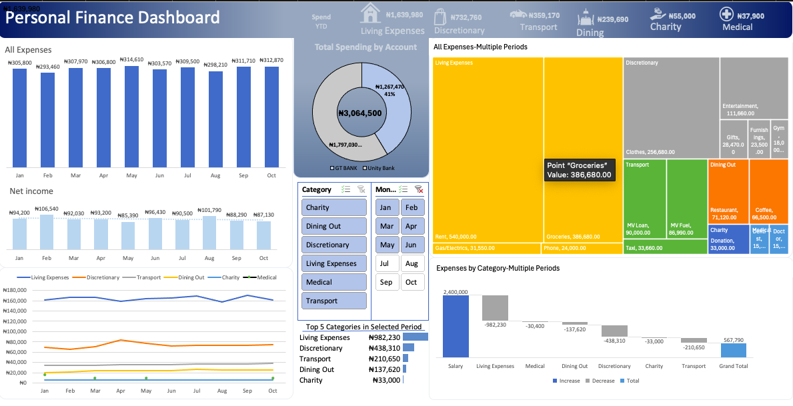

# Personal Finance Dashboard (Jan–Oct) — Excel-Based Financial Analysis

This project presents an interactive Excel-based personal finance dashboard designed to analyze income and expenses across multiple categories and time periods. The dashboard transforms transaction-level data into meaningful financial insights to support better spending decisions and financial awareness.

---

### Personal Finance Dashboard

## Dataset Description
 
- Transaction-level financial data:
  - Date
  - Description
  - Debit
  - Credit
  - Amount

- Categorized by:
  - Living Expenses
  - Discretionary
  - Transport
  - Dining Out
  - Charity
  - Medical

- Sub-categories include:
  - Rent
  - Groceries
  - Fuel
  - Entertainment
  - Utilities
  - And others

- Time coverage: **January to October**

---

## Tools Used

- Microsoft Excel
  - Pivot Tables & Pivot Charts
  - Slicers (Month, Category)
  - Advanced formulas
- Structured data cleaning and categorization

---

## Key Features

- Interactive dashboard with category and month filters
- Total spending breakdown by category and account
- Monthly income vs expense trends
- Expense concentration analysis using treemap visuals
- Net income tracking across periods
- Top spending categories identification

---

## Key Insights Generated

- Identification of major cost drivers (e.g. rent, groceries, transport)
- Spending pattern trends across multiple months
- Clear visibility into discretionary vs essential expenses
- Net income performance over time

---

## Files Included

- Raw transaction data
- Categorization tables
- Pivot tables and charts
- Interactive dashboard

---

## Next Improvement

- Budget vs Actual comparison
- Full variance analysis for financial planning
